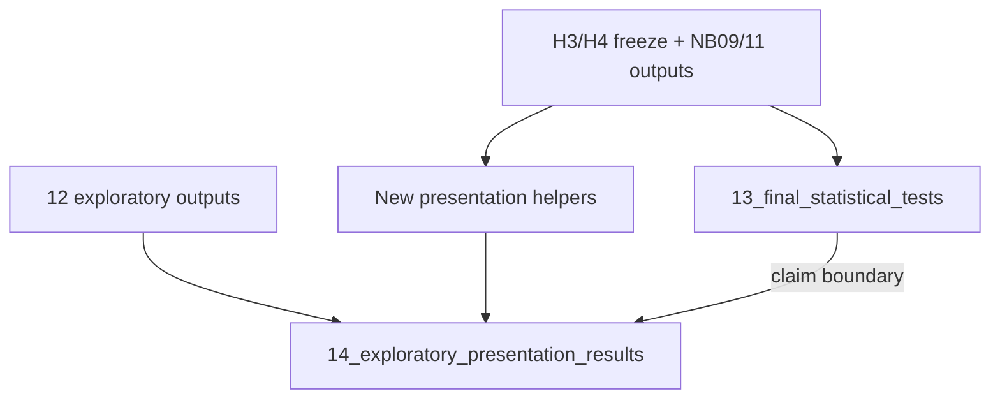

# Final confirmatory + exploratory presentation notebooks

## Locked decisions

- **NB14 builds on NB12**: reuse NB12 tables/figures for strict→broad, promise forests, presence/intensity, danger×protection, security×appearance; add only missing pieces.
- **Stage 10 `06_goodreads_validation` untouched** (taxonomy-era baseline). Residual quality/reach lives only in Stage 11 NB14.
- **No theme-bundle heatmap** in v1 (skip optional section).
- **No construct redefinition after NB13 runs.**

## Shared infrastructure

Add helpers under [`src/stage11_refined_construct_analysis/analysis/`](src/stage11_refined_construct_analysis/analysis/) (keep Stage 10 frozen; wrap its stats):

| Helper | File | Purpose |
| --- | --- | --- |
| Author-cluster Cliff’s δ CI | extend [`notebook_helpers.py`](src/stage11_refined_construct_analysis/analysis/notebook_helpers.py) | Final CI via Stage 10 [`cluster_bootstrap`](src/stage10_correlation_analysis/analysis/bootstrap.py) resampling `author_id` (book bootstrap remains secondary) |
| Outcome residualization | new `presentation.py` | `quality_resid` / `reach_resid` = residualise `rating_shrunk` / `log_n_ratings` on `publication_year`, `log_pages`/`n_sentences`, `genre_group` using [`residualise`](src/stage10_correlation_analysis/analysis/compositional.py) |
| Attention waterfall | `presentation.py` | High−low mean share for mutually exclusive refined themes (or topic shares for a fixed presentation set) |
| Dose-response | `presentation.py` | Deciles of theme share → mean adjusted quality (residual or control-adjusted) + optional smooth |
| Residual Goodreads 2×2 | `presentation.py` | Stars / hidden gems / popular-but-poor / low-low from sign of residuals; theme δ across cells |
| Conflict × repair | extend [`exploratory_security.py`](src/stage11_refined_construct_analysis/analysis/exploratory_security.py) or `presentation.py` | Mirror existing danger×protection pattern with `add_interaction` |

Reuse unchanged: `nh.test_axis`, `gated_verdict`, FDR via `tst.adjust_within_family`, NB11 `stability_summary`, exploratory YAML + NB12 tables.

Edit `_src/*.py` then sync with `scripts/stage11/percent_to_notebook.py` (existing pattern).

---

## Notebook 13 — `13_final_statistical_tests`

Path: [`notebooks/08_refined_construct_analysis/_src/13_final_statistical_tests.py`](notebooks/08_refined_construct_analysis/_src/13_final_statistical_tests.py)

**Role:** Single source of truth for reportable inferential numbers. Curate/recompute the frozen battery; do not fish new topics.

### Contents (mapped to your sections)

0. **Frozen analysis definition** markdown block: corpus/run_id, `rating_shrunk` + `log_n_ratings`, H3/H4 freeze paths, `|δ|≥.11`, controls, FDR family = six primaries only, author clustering, link to [`post_freeze_claim_hierarchy.md`](results/stage11_refined_construct_analysis/v4_l12_granular_final_call49/human_review/post_freeze_claim_hierarchy.md). Hard rule: results here do not redefine constructs.

1. **Sanity table only** — N books/authors, rating summary, tier sizes, quality↔reach correlation (not Notebook 00).

2. **Primary H1–H6 table** — one row each from the same `PRIMARY_FEATURES` as NB09:

   - H1 `RLR_emotional_vs_explicit`
   - H2 `RAX_h2_strict`
   - H3 `RLR_emotional_vs_material_security` → **unmeasurable** after freeze
   - H4 `RLR_protection_vs_control` → **unmeasurable**
   - H5 `RLR_darkness_vs_tenderness`
   - H6 `RARC`

   Columns: measure, measurement status, δ, author-cluster CI, q, adjusted regression β, verdict.

3–9. **Inferential stack** via `nh.test_axis` (δ, KW+ε², Spearman tier trend, OLS quality with cluster SE) + **author-cluster bootstrap CI as the displayed final CI**. FDR-BH only on the six primaries.

10. **Component / secondary block** (labeled non-primary): H1 affection/explicit/reassurance; H3 emotional + appearance (confirmatory claims); H4 protection atom (thin) + possession; H5 tenderness/danger/distress/relational darkness. Align claim tiers with existing `CLAIM_HIERARCHY` in NB09.

11. **H6 arc panel** — begin/mid/end medians for rising/falling, `DELTA_*`, `RARC`, high/low + adjusted regression (no new mixed models).

12. **Reach as discriminant secondary** — same final constructs → `log_n_ratings`; not part of H1–H6 support verdict.

13. **Robustness traffic-light** — read NB11 [`stability_summary`](notebooks/08_refined_construct_analysis/_src/11_refined_robustness.py) (+ semantic audit note from NB10 if available); one compact table (sign / gate / overall), not a full re-run.

14. **Final verdict table** — Supported / directional / contradicted / unmeasurable / inconclusive + one sentence each → `final_verdict_table` (+ markdown export). This is the presentation source of truth.

Outputs: `notebook_analysis/13_final_statistical_tests/{tables,figures}/`.

---

## Notebook 14 — `14_exploratory_presentation_results`

Path: [`notebooks/08_refined_construct_analysis/_src/14_exploratory_presentation_results.py`](notebooks/08_refined_construct_analysis/_src/14_exploratory_presentation_results.py)

**Banner:** Exploratory; does not change NB13 / H1–H6 confirmatory verdicts.

### Reuse from NB12 (load saved tables, light re-plot)

Load under `notebook_analysis/12_exploratory_security_care_appearance/tables/`:

- `strict_moderate_broad_trajectories` → Section 5
- `promise_type_comparison` + `topic_forest_broad_families` → Section 3
- `presence_vs_intensity` → Section E material
- `danger_x_protection_interaction` + `care_x_appearance_quadrants` → Section 7 (two of three interactions)

### New sections only

1. **What differs most** — forest of final refined features (from NB13 effects table / `nh.cliffs_delta_table`), with δ, CI, coverage, strict/broad flag.

2. **Narrative attention waterfall** — high−low mean share for a fixed mutually exclusive presentation theme set (refined atoms that partition narrative attention reasonably); annotate compositional caveat from NB00.

3. **Security/care** — presentation layout around reused NB12 promise/topic tables; for each shown topic attach id, label, taxonomy leaf, top words, one deterministic example sentence (from evidence packets / Stage 11 audit artifacts).

4. **Appearance** — Stage 10 leaf δ vs refined `RAX_appearance_grooming` + key NB11 robustness variants (word-weighted, singleton authors, genre/era).

5. **Strict→broad** — reuse NB12 trajectory plot/data.

6. **Dose-response** — deciles × residualized quality for: reassurance, appearance, tenderness, danger, explicit sex, protection, couple conflict (where columns exist).

7. **Interactions** — reuse danger×protection + reassurance×appearance from NB12; **add** conflict×repair (`DELTA_falling`/`relational darkness` × `RAX_repair` or rising repair share — use existing frame columns) with interaction plot via `mdl.add_interaction` / `fit_ols`.

8. **Quality vs reach (refined)** — standardized betas for final constructs on both channels; quadrant scatter (presentation remake of NB06 logic on Stage 11 features).

9. **Residual Goodreads quadrants** — residualise outcomes on year/length/genre; median-split 2×2; theme comparisons across stars / hidden gems / popular-but-poor / low-low.

10. **Genre/era stability heatmap** — rows = final headline refined themes; columns = `genre_group` × `year_bin` (same pattern as Stage 10 NB08 Check 8); cells = Cliff’s δ. One heatmap only.

11. **Representative books/sentences** — deterministic 2×2 (high/low theme × high/low rating) patterned after Stage 10 [`07_qualitative_triangulation`](notebooks/07_analysis/_src/07_qualitative_triangulation.py) fixed-seed sampling; pull sentences from Stage 11 evidence packets / qualitative artifacts — no cherry-picking.

Outputs: `notebook_analysis/14_exploratory_presentation_results/{tables,figures}/`.

---

## Docs / wiring

- Update [`notebooks/08_refined_construct_analysis/README.md`](notebooks/08_refined_construct_analysis/README.md): add 13 (confirmatory final) and 14 (exploratory presentation; builds on 12); restate claim boundary.
- Point exploratory follow-up in claim hierarchy docs to **14** (keep 12 as the security deep-dive source NB14 reads).
- No Stage 10 edits; no new LLM/Pass runs; no reopening H3/H4 freeze JSON.

## Out of scope

- Theme co-occurrence bundles
- Editing `notebooks/07_analysis/06_goodreads_validation*`
- New omnibus 348-topic screens, extra robustness batteries, random forests / clustering
- Changing primary feature definitions after seeing NB13 output
