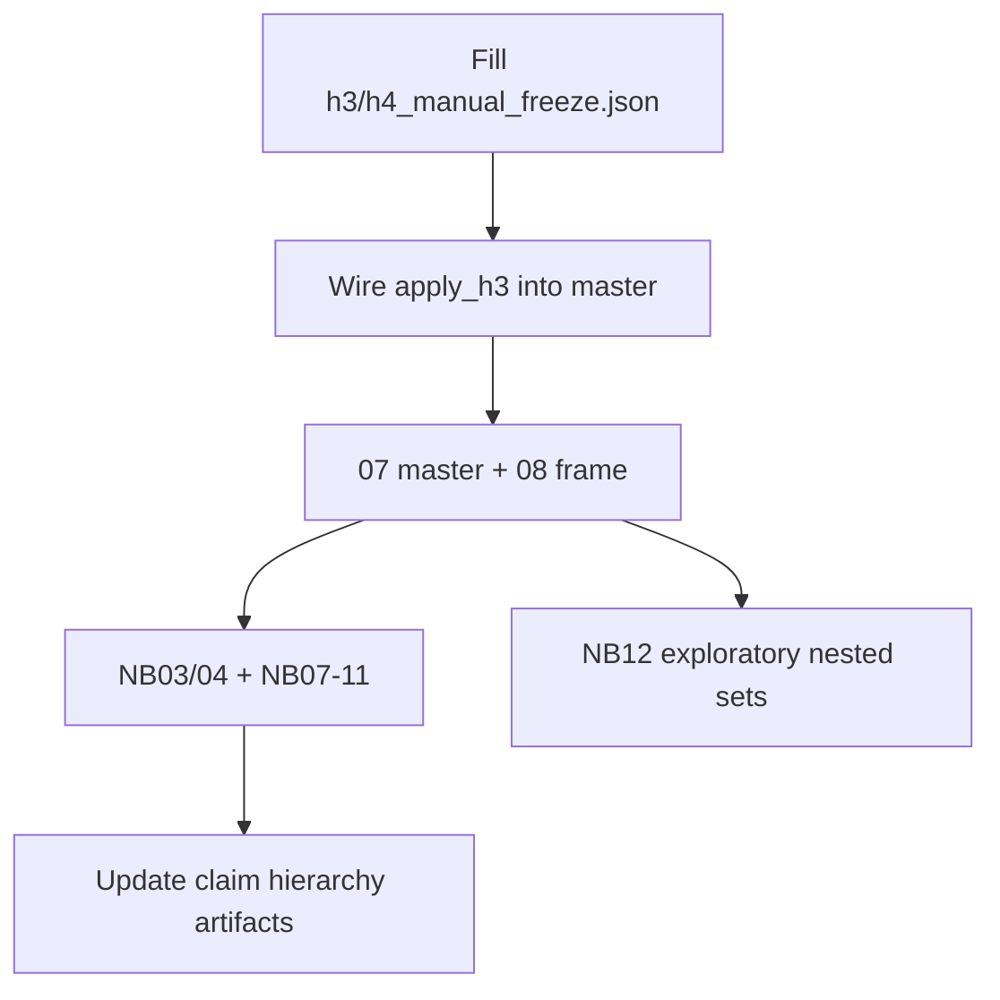

# Strict H3/H4 freeze + exploratory security notebook

## Locked interpretation of your review

**Confirmatory after freeze**

| Construct | Topics / outcome |
| --- | --- |
| H3 emotional | KEEP `29,46,56,96,242` as S1; `128,170` as **S2**; `61,65,167` as S4 |
| H3 material | REMOVE all five (`17,112,191,22,174`) → **unmeasurable** |
| H3 appearance | KEEP `18,77,171,218,253,364` as S13; move `170` out of appearance |
| H3 dependency | KEEP `345` as **S10** (not material, not gift) |
| H4 external protection | KEEP only **`119` as H4_5**; REMOVE the other eight current H4_5 topics |
| H4 protective commitment | REMOVE all current H4_5a topics (`119` leaves this bucket) → **unmeasurable** |
| H4 possession | KEEP `293` H4_8, `315` H4_7, `294` H4_9; REMOVE `181,223` |
| Fractional protection | **Exploratory only** for mixed topics (esp. `87`, `114`); confirmatory stays binary |

All other worksheet topics → `REMOVE` (H3 → `S0`, H4 → `H4_0`).

**Primary-test consequence (intentional):** `RLR_emotional_vs_material_security` and `RAX_protective_commitment` become **unmeasurable**; `RAX_external_protection` becomes **thin** (1 topic). Confirmatory H3 claims shift to emotional security + appearance; H4 protection is provisional/thin until exploratory weighting.

## Phase 1 — Encode freeze files

Write filled copies (do not leave blanks):

- [`human_review/h3_manual_freeze.json`](results/stage11_refined_construct_analysis/v4_l12_granular_final_call49/human_review/h3_manual_freeze.json) (`frozen: true`)
- [`human_review/h4_manual_freeze.json`](results/stage11_refined_construct_analysis/v4_l12_granular_final_call49/human_review/h4_manual_freeze.json) (`frozen: true`)

Seed from existing worksheets:

- [`h3_manual_freeze_decisions.json`](results/stage11_refined_construct_analysis/v4_l12_granular_final_call49/human_review/h3_manual_freeze_decisions.json) (42 topics)
- [`h4_manual_freeze_decisions.json`](results/stage11_refined_construct_analysis/v4_l12_granular_final_call49/human_review/h4_manual_freeze_decisions.json) (26 topics)

Mirror the same filled content back into `*_decisions.json` for audit trail. Include short `notes` for reassignments (`128→S2`, `170→S2`, `119→H4_5`, `315→H4_7`, `345→S10`).

## Phase 2 — Wire H3 apply (H4 already works)

H4 path is complete ([`apply_h4_manual_freeze_to_master`](src/stage11_refined_construct_analysis/analysis/h4_manual_freeze.py) called from [`master.py`](src/stage11_refined_construct_analysis/analysis/master.py)). H3 still says “when wired.”

Mirror H4 in [`h3_manual_freeze.py`](src/stage11_refined_construct_analysis/analysis/h3_manual_freeze.py):

- `validate_h3_manual_freeze` / `freeze_overrides` / `apply_h3_manual_freeze_to_master`
- REMOVE → `security_code=S0` + clear H3 family props
- KEEP → `final_code` + patch H3 Pass-B props to `{final_code: 1.0}` (same pattern as H4)
- Call from `build_master_table` immediately before/after H4 apply

Add [`scripts/stage11/apply_h3_h4_manual_freeze.sh`](scripts/stage11/apply_h3_h4_manual_freeze.sh) (validate both → 07 → 08 → NB03, NB04, NB07–11). Extend [`tests/stage11/test_h4_manual_freeze.py`](tests/stage11/test_h4_manual_freeze.py) pattern with `test_h3_manual_freeze.py`.

## Phase 3 — Confirmatory rebuild + notebook adjustments

Run the apply script so `construct_coverage.json` and the refined frame reflect the freeze.

Update [`_src/09_refined_hypothesis_tests.py`](notebooks/08_refined_construct_analysis/_src/09_refined_hypothesis_tests.py):

- Keep `RLR_emotional_vs_material_security` in the feature list but treat **unmeasurable** as the H3 primary outcome (no false “unsupported” from an empty denominator).
- Surface component findings as the reportable H3 story: `RAX_h3_emotional_side`, `RAX_appearance_grooming` (and note material unmeasurable).
- For H4: expect thin `RAX_external_protection` (t119 only); `RAX_protective_commitment` unmeasurable; possession viable.

Refresh NB03/NB04 so audit tables match post-freeze codes. Sync via `percent_to_notebook.py` then execute.

Write a short freeze note under `human_review/` stating the claim hierarchy you articulated (confirmatory / qualified / open / unsupported / unmeasurable).

## Phase 4 — Exploratory notebook `12_exploratory_security_care_appearance`

Add config [`configs/stage11/exploratory_security_care_appearance.yaml`](configs/stage11/exploratory_security_care_appearance.yaml) with nested topic sets (strict / moderate / broad) for the seven families you listed. Strict sets = post-freeze confirmatory membership; moderate/broad expand using taxonomy leaves + previously removed candidates (explicitly listed, not auto-expanded at runtime).

Fractional protection weights (exploratory only):

- Derive `W_t,protection` for mixed topics (`87`, `114`, and optionally other removed H4_5 candidates) from **existing H4 Pass B** `sentence_codes` share coded `H4_5`/`H4_6` in `audits/h4/` — no new LLM run.
- Store as `exploratory_protection_weights.json` next to the notebook outputs.
- Build `Protection_b = sum_t p_bt * W_t` as an extra frame column for this notebook only (do not write into confirmatory `W_tk_strict`).

Notebook [`notebooks/08_refined_construct_analysis/_src/12_exploratory_security_care_appearance.py`](notebooks/08_refined_construct_analysis/_src/12_exploratory_security_care_appearance.py) (banner: **all analyses exploratory; does not alter H1–H6 verdicts**), implementing:

1. Strict→moderate→broad δ trajectories with bootstrap CIs (reuse `nh.test_axis` / Cliff’s δ helpers)
2. Per-topic forest within each broad family
3. Promise-type comparison table (trust, non-harm, reassurance, belonging, partnership, protective pledge, enacted protection, practical care, material, possessive)
4. Presence vs conditional intensity per family
5. Danger × protection 2×2 + continuous interaction on `rating_shrunk` with existing controls
6. Emotional-security × appearance quadrant means
7. Fractional protection index vs strict t119-only

Outputs under `notebook_analysis/12_exploratory_security_care_appearance/`. Document in [`notebooks/08_refined_construct_analysis/README.md`](notebooks/08_refined_construct_analysis/README.md).

## Out of scope

- No new Pass A/B/C or spillover LLM runs
- No Stage 10 edits
- No reopening H1/H2/H5/H6 freezes
- No claim that fractional protection is confirmatory
