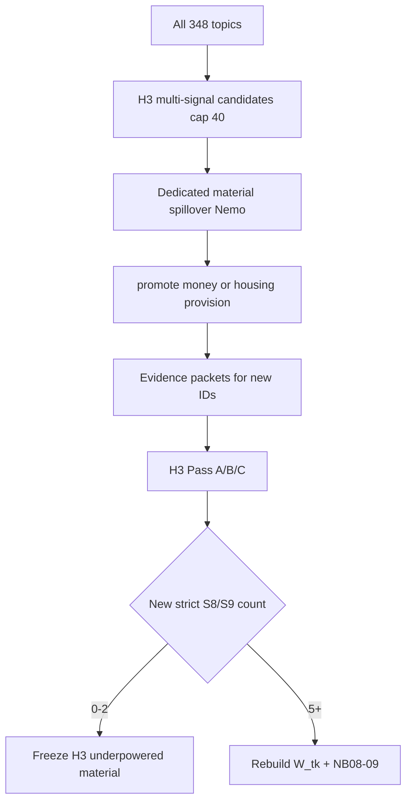

# H3 material-provision discovery (small spillover)

## Why this is needed

H3’s appearance vs material confusion is already fixed. Live numbers under strict weights:

- Emotional side: viable, δ ≈ +0.122
- Material side: **1 topic** (`17` = S9 housing); **S8 = 0**
- Ratio: thin, δ ≈ +0.041

Current H3 spillover ([`build_h3_spillover_candidates`](src/stage11_refined_construct_analysis/audits/spillover.py)) is **leaf-only** (`6.5, 8.1, 5.1, 7.3`) — not a material search. A quick label/keyword scan finds only ~9 core money/shelter hits and **misses topic 17**, so discovery must be multi-signal like H4, then sentence-confirmed via Pass B.

## Locked defaults

- **Pattern:** reuse H4 machinery at smaller scale; do **not** reuse generic H1/H3 `include` triage wording.
- **Cap:** `h3_max_candidates: 40` (vs H4’s 80).
- **LLM:** Nemo only; no Sonnet batch.
- **Constructs unchanged:** material side stays `S8 + S9` only ([`constructs.py`](src/stage11_refined_construct_analysis/analysis/constructs.py)); no new atoms; no dominance-gate change (`0.70`).
- **Do not reopen** emotional-side / appearance audits except if a topic is newly material-promoted and needs a fresh Pass A/B/C.
- **Success criterion for interpretation:**
  - **0–2** new strict S8/S9 topics → freeze: material content poorly represented at topic level; emotional measurable; emotional-vs-material underpowered.
  - **≥5** credible strict S8/S9 → rebuild frames and retest primary H3 ratio.



## Phase 1 — Candidate generator (replace leaf-only H3)

Upgrade [`build_h3_spillover_candidates`](src/stage11_refined_construct_analysis/audits/spillover.py) to full-corpus multi-signal (mirror [`build_h4_spillover_candidates`](src/stage11_refined_construct_analysis/audits/spillover.py)):

Union over non-already-strict-material topics of:

1. Mechanic tag ∈ `{economic_power, domestic_care}` (4 + 12 topics today)
2. Primary **or** secondary leaf ∈ existing discovery + material-adjacent: `6.5, 8.1, 5.1, 7.3, 6.2, 6.3, 6.4, 6.6` (keep `1.6` out of discovery — appearance already settled)
3. Word-boundary lexical hit on label + scene_summary + keyword reps, using the user’s list (money, pay/pay for, rent, mortgage, afford, buy/purchase, bills, debt, inheritance, salary/wage, wealthy/rich, financial, tuition, medical costs, provider/provide for, housing/shelter/place to stay, necessities). Treat bare `house`/`home`/`job`/`buy`/`pay` as **weak** (need a second signal to rank).
4. Rank by `#distinct signal types`; cap 40.

Config in [`configs/stage11/refined_constructs.yaml`](configs/stage11/refined_constructs.yaml) under `spillover:`:

- `h3_prompt`, `h3_max_candidates: 40`, `h3_mechanic_tags`, `h3_lexical_prototypes`, optional `h3_weak_lexical_prototypes`
- Extend `H3.spillover_discovery_leaves` to include `6.2, 6.3` (and keep using primary|secondary like H4)

Exclude from the LLM triage bill: topics already strict `S8`/`S9` (today: `17`). Still list them in the candidate JSON as `already_material` for audit trail.

## Phase 2 — Dedicated material triage prompt

Add frozen [`configs/stage11/prompts/h3_spillover_triage.yaml`](configs/stage11/prompts/h3_spillover_triage.yaml) (H4-shaped schema):

- Fields: `relationship_directed_transfer`, `provision_function`, `main_couple_target`, `exclude_reason`, `promote_to_full_H3_audit`, `supporting_cues`, `rationale`
- `provision_function` enum: `money_provision | housing_provision | economic_dependency | practical_care | status_luxury_display | appearance | workplace_status | gift_token | occupational_talk | off_target | unclear`
- Explicit **reject** rules matching the user: luxury/status display; merely being rich; expensive clothing; occupational status; general workplace talk; objects without a provision function.

Promote helper `_h3_material_should_promote`:

```
promote if promote_to_full_H3_audit
   OR (relationship_directed_transfer ∈ {yes,unclear}
       ∧ provision_function ∈ {money_provision, housing_provision})
```

Do **not** auto-promote `economic_dependency` into the primary material side (stays S10 / exploratory). Wire in [`04_run_spillover_triage.py`](src/stage11_refined_construct_analysis/pipeline/04_run_spillover_triage.py) and [`run_spillover_triage`](src/stage11_refined_construct_analysis/audits/spillover.py) like H4’s dedicated path.

## Phase 3 — Evidence + targeted Pass A/B/C

1. Run H3 spillover on Nemo → `candidates/h3_spillover.json` + `audits/h3/spillover_triage.jsonl`.
2. Build evidence packets only for newly promoted IDs missing packets.
3. Run H3 Pass A/B/C **only for** promoted IDs not already adjudicated, plus any previously audited promoted ID that needs a material re-check (expected ~10–20 topics, not the full H3 pool).
4. Existing codebook [`h3_security.yaml`](configs/stage11/prompts/h3_security.yaml) already defines S8/S9 and status exclusions — **no codebook bump** unless Pass C repeatedly collapses provision into S12/S15 (then a one-line decision-rule note, not a redesign).

Sentence evidence gate = Pass B: only topics that land **S8 or S9 with Pass B share ≥ 0.70** enter strict `RAX_h3_material_side`. Near-misses (e.g. S9 at ~0.45 like topic 174) are reported in a short discovery note but do **not** change the gate.

## Phase 4 — Downstream (conditional)

- Refresh H3 human-review export for new/changed topics.
- **If 0–2 new strict material topics:** no full NB rebuild required; write a short freeze note in the H3 human-review / NB09 changelog stating material under-representation and underpowered ratio. Optionally re-run NB08 coverage table only.
- **If ≥5 new strict S8/S9:** rebuild master → `W_tk` → book features → NB07–09 (H3 rows); leave H1/H2/H4–H6 audits frozen.

## Phase 5 — Tests

Mirror [`tests/stage11/test_h4_spillover_freeze.py`](tests/stage11/test_h4_spillover_freeze.py):

- Candidate builder includes known seeds (`22` payment/debts, `191` bills, `17` already-material excluded from triage bill, `112` job tagged but should need triage reject unless provision-directed).
- Cap ≤ 40; mandatory appearance leaf `1.6` not used as discovery signal alone.
- `_h3_material_should_promote` accepts money/housing; rejects status/workplace/gift.

## Effort bound

~1 day: config + builder + prompt + triage run + small Pass A/B/C + interpretation. Not another H4-scale audit.