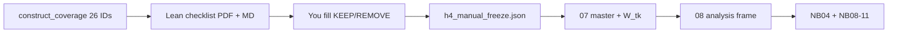

# H4 manual freeze PDF + construct rebuild

## Locked defaults

- **Scope:** only the 26 atom-relevant topics from current [`construct_coverage.json`](results/stage11_refined_construct_analysis/v4_l12_granular_final_call49/constructs/construct_coverage.json) — not the full 71-topic H4 audit pool.
  - External protection (`H4_5`): `68, 78, 87, 107, 113, 114, 122, 307, 363`
  - Protective commitment (`H4_5a`): `20, 24, 73, 100, 102, 119, 148, 239, 240, 329, 335, 338`
  - Possession/control (`H4_7/8/9`): `181, 223, 293, 294, 315`
- **No LLM:** do not re-run Pass A/B/C or spillover triage.
- **REMOVE semantics:** set `care_protection_code` → `H4_0` (off-target; drops out of W_tk atoms). KEEP may keep or reassign the final H4 code.
- **Rebuild gate:** construct rebuild + notebooks run only after the decision worksheet is filled (not on empty blanks).



## Phase 1 — Lean checklist PDF (highest priority)

Add a focused exporter (prefer dedicated script to avoid bloating the all-topics pack):

[`scripts/stage11/export_h4_manual_freeze_pdf.py`](scripts/stage11/export_h4_manual_freeze_pdf.py)

Reuse packet/sentence loading from [`export_human_review_pdf.py`](scripts/stage11/export_human_review_pdf.py) / [`review_display.load_topic_review`](src/stage11_refined_construct_analysis/analysis/review_display.py) (falls back to evidence packets — 17 of the 26 currently lack `human_review/topic_XXXX.json` but all have evidence packets).

**Outputs** under `results/.../human_review/`:

- `stage11_h4_manual_freeze.pdf` — one topic per page (or tight KeepTogether blocks)
- `stage11_h4_manual_freeze.md` — markdown twin
- `h4_manual_freeze_decisions.json` — blank worksheet seeded with the 26 IDs

**Per-topic content (only these fields):**

| Field | Source |
| --- | --- |
| topic ID + label | master |
| taxonomy ID/name | master `current_taxonomy_*` |
| four keyword reps | master `main_keywords`, `keybert_keywords`, `pos_keywords`, `mmr_keywords` |
| sampled sentences | review packet (≤12), no Pass A/B/C rationales |
| current code | `care_protection_code` (H4_5 / H4_5a / H4_7–9) |
| external threat | blank `yes/no` |
| main romantic target | blank `yes/no` |
| protection/commitment/control code | blank (pre-fill current as suggestion) |
| KEEP / REMOVE | blank |

Front matter: short H4_5 vs H4_5a vs possession decision rules (from [`h4_protection.yaml`](configs/stage11/prompts/h4_protection.yaml) v1.2) + the contradiction trap (“do not code H4_5 if rationale/evidence says no external threat”).

Grouped sections: External protection → Protective commitment → Possession/control.

## Phase 2 — Human override layer (no JSONL surgery)

1. Canonical freeze file (filled by you after PDF review):

`results/stage11_refined_construct_analysis/v4_l12_granular_final_call49/human_review/h4_manual_freeze.json`

```json
{
  "hypothesis": "H4",
  "frozen": true,
  "decisions": [
    {
      "topic_id": 68,
      "decision": "KEEP",
      "final_code": "H4_5",
      "external_threat": "yes",
      "main_romantic_target": "yes",
      "notes": ""
    }
  ]
}
```

2. In [`master.py`](src/stage11_refined_construct_analysis/analysis/master.py) `build_master_table`: after Pass C codes are assigned, if freeze file exists with `frozen: true`, apply overrides to `care_protection_code` (`REMOVE` → `H4_0`; `KEEP` → `final_code`). Record `adjudication_actions` entry like `H4:HUMAN_KEEP` / `H4:HUMAN_REMOVE` for auditability.

3. Small unit test: override REMOVE drops topic from `RAX_external_protection` under strict W_tk.

Config path key optional in [`refined_constructs.yaml`](configs/stage11/refined_constructs.yaml) (`h4_manual_freeze_path`); default to the human_review path above.

## Phase 3 — Rebuild after freeze is filled

Helper script [`scripts/stage11/apply_h4_manual_freeze.sh`](scripts/stage11/apply_h4_manual_freeze.sh):

1. Validate all 26 topics have `decision` ∈ `{KEEP,REMOVE}` and KEEP rows have a valid final code.
2. `07_build_master_table.py` → `08_build_refined_analysis_frame.py` (no audits).
3. Sync + execute notebooks:
   - [`04_h4_protection_possession_audit`](notebooks/08_refined_construct_analysis/_src/04_h4_protection_possession_audit.py) — currently frozen render still prints **H4-coded topics: 32** while NB07 already sees 71.
   - `07`–`11` (dictionary, validity, tests, contextual, robustness) via `percent_to_notebook.py` + `jupyter nbconvert --execute --inplace`.
4. Optionally refresh full `export_human_review_pdf.py` so H4 MD legend includes `H4_5a` and topic count matches master (secondary; not a substitute for the lean freeze PDF).

## Out of scope

- Re-auditing the other ~45 H4-coded topics (care/reassurance/off-target).
- Changing H4 composites / primary contrast definition (`RAX_h4_protection_side` = external protection only).
- Presentation narrative edits beyond refreshed notebook outputs.

## Immediate handoff

After Phase 1 lands: open `stage11_h4_manual_freeze.pdf`, fill KEEP/REMOVE (and corrected codes) into `h4_manual_freeze_decisions.json` / rename to `h4_manual_freeze.json` with `"frozen": true`, then run the apply script.