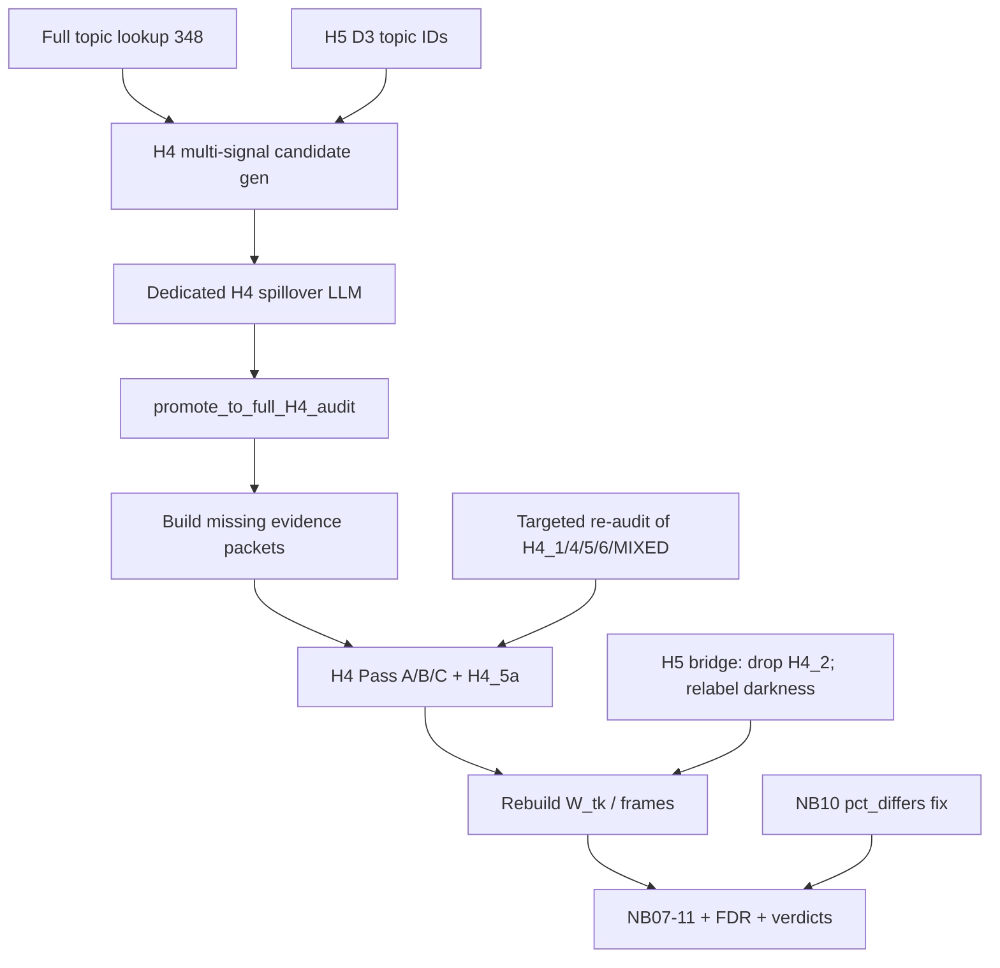

# Stage 11 pre-freeze: H4 spillover + remaining fixes

## Defaults locked in this plan

- **H4 re-audit scope:** targeted — re-run Pass A/B/C with the expanded codebook on (a) newly spillover-promoted topics and (b) already-audited H4 topics whose current code is in `{H4_1, H4_4, H4_5, H4_6, MIXED, H4_13}` (covers 299/247/172 without re-billing every off-target sleep topic). Leave clear `H4_0` / possession / control codes frozen.
- **LLM routing:** keep H4 spillover triage and Pass A/B/C on primary **Nemo** (`mistralai/Mistral-Nemo-Instruct-2407`; ~$0.01, ~1 h). **Do not** run the full H4 batch on Claude Sonnet. Sonnet (`anthropic/claude-sonnet-4.6`) is only for an optional stability-pilot re-run or a small disagreement sample after Nemo (not the full batch).
- **H5 darkness:** no new 7.2 partner-source LLM audit. Keep atom key `RAX_relational_darkness` for frame continuity; update display labels/narrative to **interpersonal/conflict darkness**; remove `H4_2` from the tenderness bridge.
- **H2 commitment exploratory composite:** out of scope for this freeze pass.
- **Semantic discovery:** deterministic multi-signal union over all 348 topics (mechanic tags, H5 D3, primary/secondary leaves, lexical prototype match). No new embedding index.



---

## Phase 1 — Deterministic presentation fixes (no LLM)

### 1a. Notebook 10 `pct_differs` denominator

In [`notebooks/08_refined_construct_analysis/_src/10_contextual_validation.py`](notebooks/08_refined_construct_analysis/_src/10_contextual_validation.py) (and synced `.ipynb`), change aggregation from `(s == True).mean()` over all topics to the comparable-only rate:

`n_differs / n_with_both_high_prev` ≡ `(s == True).sum() / s.notna().sum()`.

Expected: H1 14.3%, H3 26.8%, H4 12.5%, overall 23/142 = 16.2%.

### 1b. Hypothesis-aware verdicts + FDR in Notebook 09

Update [`src/stage11_refined_construct_analysis/analysis/notebook_helpers.py`](src/stage11_refined_construct_analysis/analysis/notebook_helpers.py):

- Extend `verdict` / `gated_verdict` / `test_axis` with `expected_sign: Optional[int]` mirroring Stage 10 [`05_hypothesis_tests.py`](notebooks/07_analysis/_src/05_hypothesis_tests.py) labels: `supported` | `directionally consistent, effect below threshold` | `contradicted` | `no reliable effect`, plus existing `unmeasurable` / `thin:*` wrappers.
- Wire expected signs in NB09 for the six primaries (H1–H4 +1 for predicted ratios; H5 darkness>tenderness ratio +1 if that remains the stated prediction; H6 rising-arc +1). Components stay secondary without claiming primary support.
- After the six primary `test_axis` rows, apply Stage 10 `adjust_within_family(..., method="fdr_bh")` from [`src/stage10_correlation_analysis/analysis/tests.py`](src/stage10_correlation_analysis/analysis/tests.py) to primary `kw_p` / quality p-values; label component p-values as exploratory/unadjusted in the notebook text.

### 1c. Narrow H5 bridge

In [`src/stage11_refined_construct_analysis/analysis/constructs.py`](src/stage11_refined_construct_analysis/analysis/constructs.py):

- Remove `H4_2` from `H5_TENDERNESS_H4_CODES` (keep `H4_1, H4_4, H4_12`).
- Keep `H5_DARKNESS_ANCHOR_LEAVES = {7.2, 4.4}` injection in [`master.py`](src/stage11_refined_construct_analysis/analysis/master.py) `_h5_bridge_rows`, but change NB07/08/09 display labels / dictionary prose from “relational darkness” to **interpersonal/conflict darkness**, with an explicit note that partner-vs-external source was not topic-audited for `7.2`.
- Update [`tests/stage11/test_master_table.py`](tests/stage11/test_master_table.py) tenderness-bridge expectations.

---

## Phase 2 — H4 high-recall discovery + `H4_5a`

### 2a. Config

Extend H4 block in [`configs/stage11/refined_constructs.yaml`](configs/stage11/refined_constructs.yaml):

```yaml
H4:
  mandatory_leaves: ["4.6", "4.7"]
  spillover_discovery_leaves: ["7.3", "7.2", "6.5", "9.2", "5.2", "4.5"]
  inherit_from: ["H5_D3"]
  # full-corpus multi-signal discovery (see spillover.h4_*)
```

Extend `spillover:` with H4 keys: mechanic tags (`protective_care`, `external_threat`), lexical prototype token list, `h4_max_candidates` (default 80, ranked by signal-count), and path to a dedicated triage prompt.

### 2b. Candidate builder

Add `build_h4_spillover_candidates()` in [`src/stage11_refined_construct_analysis/audits/spillover.py`](src/stage11_refined_construct_analysis/audits/spillover.py):

Union over all non-mandatory topics of:
1. Stage-09 mechanic tag ∈ `{protective_care, external_threat}`
2. Master/`darkness_code` == `D3` (H5 inherit)
3. Primary **or** secondary taxonomy ∈ spillover discovery leaves
4. Lexical hit of protection prototypes against label + scene summary + four keyword reps
5. External-threat language **and** promise/future-action co-signal (bonus rank)

Exclude topics already `role=mandatory`. Rank by number of distinct signals; cap at `h4_max_candidates`. Ratings/effects stay hidden (reuse existing spillover packet view).

Wire into [`pipeline/04_run_spillover_triage.py`](src/stage11_refined_construct_analysis/pipeline/04_run_spillover_triage.py) and `run_pipeline.sh` (H1,H3,**H4**).

Manifest: [`lookup.py`](src/stage11_refined_construct_analysis/lookup.py) already packs `spillover_discovery_leaves`; ensure H4 entries get `role=spillover_discovery` and `resolve_audit_topic_ids` continues to pull only `load_spillover_promoted`.

### 2c. Dedicated H4 spillover prompt

Add [`configs/stage11/prompts/h4_spillover_triage.yaml`](configs/stage11/prompts/h4_spillover_triage.yaml) (frozen) implementing the user’s narrow schema: `external_threat`, `protective_action`, `main_couple_target`, `autonomy_effect`, `function`, `promote_to_full_H4_audit`, with sentence-ID supports.

Promotion rule (high recall): promote if `(external_threat ∈ {yes,unclear} ∧ protective_action ∈ {yes,unclear})` **or** `function ∈ {protective_commitment, rescue_search, physical_external_protection, social_legal_external_protection}`.

Do **not** reuse the generic H1/H3 [`spillover_triage.yaml`](configs/stage11/prompts/spillover_triage.yaml) wording for H4.

### 2d. Codebook: `H4_5a` + new atoms

Bump [`configs/stage11/prompts/h4_protection.yaml`](configs/stage11/prompts/h4_protection.yaml) to **v1.2** (unfreeze briefly, then re-freeze):

- Add **H4_5a — protective_commitment / responsibility** (explicit safety/welfare responsibility without a concrete external threat strong enough for H4_5/H4_6).
- Update decision rules: H4_5/H4_6 still require external threat; H4_5a for pledge/responsibility without clear threat; ordinary care/food/reassurance stay H4_1–H4_4; control stays H4_9–11.
- Update Pass A/B/C JSON schemas / valid-code lists to accept `H4_5a`.

In [`constructs.py`](src/stage11_refined_construct_analysis/analysis/constructs.py):

- Widen `normalize_code` soft regex to `H4_\d{1,2}a?` (and aliases).
- `CODE_TO_RAX["H4_5a"] = ["RAX_protective_commitment"]` (new atom — **not** collapsed into external protection).
- Composites:
  - `RAX_external_protection` = H4_5 + H4_6 (unchanged)
  - `RAX_protective_commitment` = H4_5a
  - `RAX_protective_care_broad` = external_protection + protective_commitment
  - Keep `RAX_h4_protection_side` = **external_protection only** for the primary protection>possession contrast (commitment is secondary/exploratory, matching the user’s three-atom design).
- Do **not** add H4_5a to `H5_TENDERNESS_H4_CODES`.

### 2e. Evidence + audit execution

1. Rebuild H4 manifest (`01_build_candidate_manifests`).
2. Run H4 spillover triage **on Nemo** → `h4_spillover.json`.
3. Build evidence packets only for newly promoted IDs missing from `evidence_packets_dir` (`02` / targeted packet build).
4. Run H4 Pass A/B/C **on Nemo** for: promoted IDs ∪ targeted re-audit set above. Resume-safe against existing `audits/h4/*.jsonl`. Optional: Sonnet Pass A only on a small Nemo-disagreement / MIXED sample — not the full set.
5. Refresh human-review packet for H4 only if the export script supports hyp filtering; otherwise regenerate H4 section.

### 2f. Downstream rebuild (H4-focused, full frame refresh)

Because `W_tk` / book frames are shared:

1. Rebuild master + `W_tk` + refined book features (pipeline 07–08).
2. Refresh NB07 dictionary freeze (new atoms + H4 topic lists).
3. Re-run NB08–11 (gates, tests, contextual validation, robustness). H1–H3/H6 numbers may shift slightly only via H5 tenderness bridge change and any shared frame rebuild — call that out in the notebook changelog; do **not** reopen H1–H3 audits.

---

## Phase 3 — Tests

- Unit: `build_h4_spillover_candidates` includes known seeds (172 if tagged/lexical; 223/324/335/327/184/284 via D3 or 7.3; 100 via 9.2 / promise lexicon) and excludes pure mandatory-only duplicates.
- Unit: `normalize_code("H4_5a")`, `rax_for_code`, composite defs.
- Unit: NB10-style pct aggregation helper if extracted; else notebook `_src` regression check.
- Unit: `gated_verdict(..., expected_sign=-1)` → `contradicted` for negative reliable large effects.
- Update H5 bridge test for removed `H4_2`.

---

## Interpretation guardrails (post-rerun)

- Report `RAX_external_protection` and `RAX_protective_commitment` separately; use `RAX_protective_care_broad` only as exploratory.
- Keep measurement gates (`thin` / `unmeasurable`); do not claim general “protection predicts ratings” until strict external-protection coverage exceeds one topic.
- Expect roughly 3–6 external-protection and 3–8 protective-commitment topics after filtering, plus many false positives — treat that as success of the high-recall → strict-filter design.
