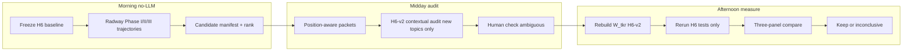

# One-day H6 Radway-assisted recovery

## Baseline facts (already in repo)

- Current refined H6 is thin: `RARC ≈ +0.007`, `DELTA_rising ≈ 0`, `DELTA_falling ≈ −0.007`; strict `RAX_arc_rising` = **2 topics** (`102`, `244`) in [`construct_coverage.json`](results/stage11_refined_construct_analysis/v4_l12_granular_final_call49/constructs/construct_coverage.json).
- Stage 10 leaf arc: all six leaves rise begin→end → only **3/6** match predicted direction ([`H6_within_book_shifts`](results/stage10_correlation_analysis/v4_l12_granular_final_call49/notebook_analysis/05_hypothesis_tests/tables/)).
- Radway source of truth: [`taxonomy_with_radway.json`](results/stage09_category_mapping/stage2_radway_functions/placeholder_v4_call49_rerun2/taxonomy_with_radway.json) (includes `radway_other_plausible_ids`); flat join via [`topic_lookup.parquet`](results/stage10_correlation_analysis/v4_l12_granular_final_call49/taxonomy_radway_eda/topic_lookup.parquet) (secondary present; other-plausible JSON-only).
- Approximate Radway pools (main|secondary): rising R9/10/11/13 ≈ **90** topics; falling R2/3/5/6/7 ≈ **55** — far larger than the current 29 H6 set, so ranking is mandatory.
- **Data-state fix (default):** live [`audits/h6/`](results/stage11_refined_construct_analysis/v4_l12_granular_final_call49/audits/h6/) is the older Nemo free-form run; Sonnet ARC_* 29-topic run is in `archive_before_restore_*`. **Restore Sonnet 29 as frozen membership; audit only the new ranked candidates** under the new prompt. Do not re-open H1–H5.

## Architecture

## Deliverables (exactly four + decision)

Under `results/stage11_refined_construct_analysis/v4_l12_granular_final_call49/h6_radway_day/`:

1. `h6_radway_candidate_manifest.csv`
2. `h6_position_audit.jsonl` (new topics only; Sonnet 29 stay in restored `audits/h6/`)
3. `W_tkr_h6_v2.parquet` (merged restored 29 + new audits)
4. One three-panel plot: Stage10 taxonomy arc / Radway-phase / refined H6-v2
5. Decision note: keep if strict rising ≥ 3–5 credible topics; else freeze as undermeasured/inconclusive

---

## Step 0 — Freeze baseline (08:30)

Write `h6_radway_day/baseline_freeze.json` from existing NB09 / coverage:

- `RARC`, `DELTA_rising`, `DELTA_falling`
- strict rising topic_ids `[102, 244]`, falling n=25
- Stage10 δ = 0.044, 3/6 leaf direction match
- Pointer to restored Sonnet audit archive path

Restore Sonnet ARC_* jsonl into `audits/h6/` (backup live Nemo aside) so master rebuild is ARC-consistent before adding new topics.

---

## Step 1 — Direct Radway Phase I/II/III trajectories (09:00, no LLM)

New analysis module (reuse Stage10 tertile machinery):

- Input: [`tertile_topic_counts.parquet`](results/stage10_correlation_analysis/v4_l12_granular_final_call49/topic_counts_hard/tertile_topic_counts.parquet) × Radway from `topic_lookup` + JSON other-plausible if needed for sensitivity only
- Constructs (topic shares summed within book×tertile, renormalized):
  - `RADWAY_I = R1…R7`
  - `RADWAY_II = R8+R9+R10`
  - `RADWAY_III = R11+R12+R13`
- Primary: **main assignment only**; sensitivity: main ∪ secondary
- Outputs: begin→middle→end means overall + by `rating_class`; within-book `end−begin` deltas; Cliff’s δ / tier trend via existing [`effects.py`](src/stage10_correlation_analysis/analysis/effects.py) / [`arc.py`](src/stage10_correlation_analysis/analysis/arc.py) patterns
- Notebook or thin script under `notebooks/08_refined_construct_analysis/` (e.g. `12_h6_radway_phase_trajectories`) writing tables/figures into `h6_radway_day/radway_phases/`

Research questions kept separate: (1) genre grammar Phase I→III? (2) rating-discriminating?

---

## Step 2 — Candidate manifest + score (10:15)

Script: `scripts/stage11/build_h6_radway_candidate_manifest.py` (or `src/stage11_refined_construct_analysis/pipeline/…`).

**Union of four sources** (candidates only — never auto-label ARC):

| Source | Rising clue | Falling clue |
|--------|-------------|--------------|
| Current H6 | keep all 29 audited IDs | same |
| Radway | main/sec/other: R9,R10,R11,R13 (+ R8,R12 lower) | R2,R3,R5,R6,R7 |
| Stage11 refined | `RAX_emotional_reassurance/intimacy`, H4 tenderness/protective_commitment; H2 public_union if any | `RAX_relational_darkness`, possessive/control |
| Taxonomy | — | 4.3, 4.4, relevant 3.2 |

**Outcome-blind score** (as specified):

- +3 / +2 / +1 for Radway main / secondary / other-plausible in priority sets
- +2 matching Stage11 refined atom
- +1 relevant taxonomy leaf
- +1 medium/high Radway confidence

Select top **~25 new** topics not already adequately in the H6-29 set (prefer rising-side recovery: force at least ~12 of the 25 from rising Radway tags). Write `h6_radway_candidate_manifest.csv` with score breakdown + source flags; ratings/effect sizes never used.

Crosswalk lives only in this script/config snippet (`configs/stage11/h6_radway_crosswalk.yaml`) — not back-written into Stage09.

---

## Step 3 — Position-aware evidence packets (12:15)

Extend [`packets.py`](src/stage11_refined_construct_analysis/evidence/packets.py) with design `position_x_books` (H6-day only via CLI flag or config override):

- Sample **3–4 books × 3 tertiles × 3–4 sentences** of high-confidence hard assignments where available
- Packet public face: TOPIC ID, LABEL (public), Main/KeyBERT/POS/MMR, BEGINNING/MIDDLE/ENDING sentence blocks
- **Hide until Pass C:** rating, current H6 result, Radway tags, taxonomy IDs (extend `pass_c_reveal` with `radway_main/secondary/plausible` + Stage11 codes)
- Rebuild packets only for the ~25 new topic IDs via existing incremental builder pattern ([`02b_rebuild_evidence_incremental.py`](src/stage11_refined_construct_analysis/pipeline/02b_rebuild_evidence_incremental.py))

---

## Step 4 — Narrower H6 prompt + audit (13:30)

Add **new** prompt file [`configs/stage11/prompts/h6_arc_v2.yaml`](configs/stage11/prompts/h6_arc_v2.yaml) (leave frozen v1.1 intact):

- Same ARC_0–ARC_10 codebook
- Stronger rules: ARC_7 ≠ mere tenderness; ARC_8 ≠ mere sex/marriage tokens; ARC_1–4 require main-couple implication; external danger → ARC_9
- Pass B must return per-position dominant code, main_couple proportion, relationship_state_change, `stable_function_across_positions`, recommended strict/weighted H6 inclusion, and `proportions_by_tertile` (already consumed by [`build_W_tkr_from_h6`](src/stage11_refined_construct_analysis/analysis/master.py))
- Pass C reveals taxonomy + Radway + Stage11 codes and asks support/contradict

Run audit **only on new topic IDs** with Sonnet (`anthropic/claude-sonnet-4.6`), writing to `h6_radway_day/h6_position_audit.jsonl` and merging into `audits/h6/` for those IDs only (resume-safe; do not overwrite restored 29).

Wire via thin wrapper around [`06_run_h5_h6_audits.py`](src/stage11_refined_construct_analysis/pipeline/06_run_h5_h6_audits.py) (`--topic-ids-file` + `--prompt-override`).

---

## Step 5 — Human check + membership freeze (15:00)

- Auto-flag ambiguous / high-impact (MIXED, ARC_10, rising-side candidates, Radway↔audit disagreement)
- Short human-review MD/PDF export for flagged cases only (reuse [`export_human_review_pdf.py`](scripts/stage11/export_human_review_pdf.py) patterns)
- Freeze `h6_radway_day/h6_v2_membership.json`: union of restored 29 + KEEP/INCLUDE new topics with strict/weighted rising/falling flags

Hard inclusion rule for rising: only ARC_5–8 with main_couple evidence; no criterion weakening to chase significance.

---

## Step 6 — Rebuild `W_tkr` + H6 tests only (16:00)

- Merge Pass B into standard `audits/h6/contextual.jsonl` for included topics
- Run [`07_build_master_table.py`](src/stage11_refined_construct_analysis/pipeline/07_build_master_table.py) → copy/symlink `W_tkr.parquet` also to `W_tkr_h6_v2.parquet` under `h6_radway_day/`
- Run [`08_build_refined_analysis_frame.py`](src/stage11_refined_construct_analysis/pipeline/08_build_refined_analysis_frame.py)
- Re-execute **only** H6 rows of NB09 / NB11 (or a small `13_h6_v2_rerun` notebook that calls `_h6_arc_deltas` + existing effect helpers) — **no H1–H5 rebuild**
- Record new RARC, rising/falling Δ, CIs, tier trend vs `baseline_freeze.json`

---

## Step 7 — Three-panel triangulation + decision (16:45)

One figure (`h6_radway_day/figures/h6_three_panel.png`):

1. Stage10 taxonomy rising vs falling leaf shares begin→end
2. Radway Phase I / II / III shares begin→end (main-only)
3. Refined H6-v2 `RAX_arc_rising` vs `RAX_arc_falling` begin→end (via `W_tkr`)

Optional second row: same by rating tier (high vs low).

**Hard stop:**

- If strict `RAX_arc_rising` grows from 2 to **≥3–5** credible topics → retain H6-v2 as final refined H6; update [`refined_constructs.yaml`](configs/stage11/refined_constructs.yaml) H6 prompt pointer to v2 + membership path.
- If still **&lt;3** → do not relax semantics; freeze prose: *H6 remains undermeasured/inconclusive under strict main-couple validation*; keep Radway-phase plots as the scientific consolation (genre arc vs rating discriminator).

---

## Implementation touchpoints (minimal)

| Piece | Path |
|-------|------|
| Crosswalk + score config | `configs/stage11/h6_radway_crosswalk.yaml` |
| Prompt v2 | `configs/stage11/prompts/h6_arc_v2.yaml` |
| Manifest builder | `scripts/stage11/build_h6_radway_candidate_manifest.py` |
| Radway phase analysis | `src/stage11_refined_construct_analysis/analysis/radway_phases.py` + notebook `12_…` |
| Position sampling | `evidence/packets.py` + CLI rebuild for new IDs |
| Audit runner flag | extend `06_run_h5_h6_audits.py` |
| Day outputs | `results/.../h6_radway_day/` |
| Comparison notebook | `13_h6_v2_triangulation` |

No Stage09 remapping; no H1–H5 re-audit; no automatic Radway→ARC conversion.
