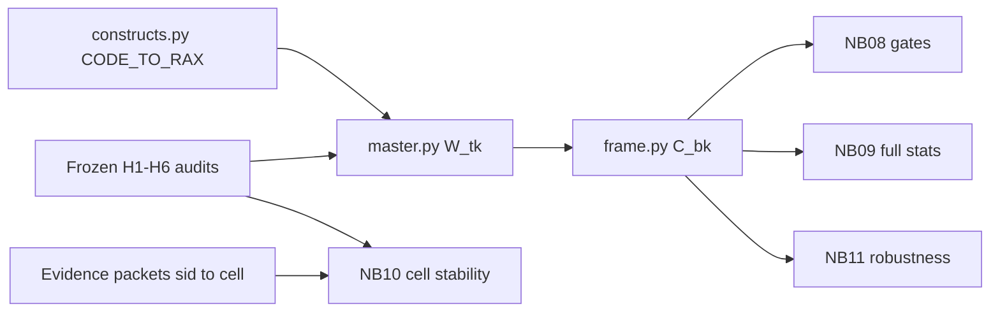

# Stage 11 Downstream Construction Fixes

Audits stay frozen (no LLM re-runs). All work is in mapping, weight construction, frames, tests, and notebooks 07–11, then a deterministic rebuild of `W_tk` / refined frames / notebook outputs.

## Confirmed bugs (code)

| Issue | Where | Evidence |
|-------|-------|----------|
| H6 `ARC_4`→rising, `ARC_8`→external | [`constructs.py`](src/stage11_refined_construct_analysis/analysis/constructs.py) L206–210 | Frozen [`h6_arc.yaml`](configs/stage11/prompts/h6_arc.yaml): ARC_1–4 falling, ARC_5–8 rising, ARC_9 external |
| H3 S13/S15 folded into status display; S11/S14 mis-mapped | same L177–182 | S13→`RAX_status_display`; S14→material; S11→institutional |
| H4_4 → medical care | same L188 | Frozen H4_4 = `emotional_support` |
| Cross-family `strict_weight`/`weighted_weight` | [`master.py`](src/stage11_refined_construct_analysis/analysis/master.py) L154–171, L232–246 | `max` across H1–H6; audited fallback forces strict=1; weighted keeps only dominant share; MIXED→0; inclusive ignores secondary |
| H5 RLR mechanically zero | no post-audit inject into RAX | Focus audit yields only D3/D4; `skip_full_relabel` 7.2/4.4 never enter W_tk; H1/H4 tenderness priors used only as prompt notes |
| NB10 `meaning_differs_across_cells` | [`10_contextual_validation.py`](notebooks/08_refined_construct_analysis/_src/10_contextual_validation.py) | Field never in Pass B schema → all NaN |
| NB09 δ-only; NB11 six primaries only | `_src/09_*.py`, `_src/11_*.py` | Stage 10 [`05_hypothesis_tests.py`](notebooks/07_analysis/_src/05_hypothesis_tests.py) has full `test_axis` |



---

## Phase A — Construction (must land before any “final” δ)

### A1. Fix `CODE_TO_RAX` + composites ([`constructs.py`](src/stage11_refined_construct_analysis/analysis/constructs.py))

**H6 (hard):**
- `ARC_4` → `RAX_arc_falling`
- `ARC_8` → `RAX_arc_rising`
- Fix stale aliases (`DISCLOSURE`→ARC_5, repair→ARC_6, restored trust→ARC_7, external→ARC_9)

**H3 (per your review):**
- `S12` → `RAX_status_display`
- `S13` → **new** `RAX_appearance_grooming`
- `S15` → **new** `RAX_workplace_status`
- Optional exploratory composite `RAX_social_presentation` = S12+S13+S15 atoms (not the primary H3 ratio)
- `S11` → `RAX_practical_care` (with S5)
- `S14` → **new** `RAX_gift_romance_token` (exclude from `RAX_h3_material_side`)
- `S10` → **new** `RAX_economic_dependency` (exclude from material side; control/dependency ≠ mutual provision)
- Keep `RAX_h3_material_side` = material_provision + housing only (S8/S9); drop S10/S14 from that sum

**H4 (hard):**
- `H4_4` → `RAX_emotional_reassurance` (not medical care)
- Keep `H4_5`/`H4_6` → `RAX_external_protection` (drop redundant dual-write to `RAX_physical_protection` unless still needed as H3 atom elsewhere)
- Fix aliases if swapped (`CLAIMING`/`JEALOUSY` vs H4_7/H4_8)

**H5 atoms:** leave D1–D5 maps as-is; bridging is A3.

Update dictionary freeze text in NB07 / `dictionary_freeze.json` generation so new atoms appear.

### A2. Family-specific `W_tk` ([`master.py`](src/stage11_refined_construct_analysis/analysis/master.py))

Replace topic-level max scalars with **per-hypothesis** Pass B proportion maps.

| Mode | Rule |
|------|------|
| **Strict** | For each hyp: if dominant code share ≥ `weights.strict_dominance` (0.70) and code not MIXED/off-target → weight 1 for that code’s RAX atoms; else exclude. **Remove** audited→1 fallback. |
| **Weighted** | For each hyp: emit one weight row per credible Pass B code with its proportion (e.g. 0.65 I3 + 0.35 I6). Drop off-target / zero mass. No cross-family max. |
| **Inclusive** | Primary adjudicated code at 1.0 **plus** documented secondary (Pass B runners-up above a small floor, and/or `secondary_id` / `proposed_constructs` from Pass C) at a fixed sensitivity weight (e.g. 0.5). |

Mirror the already-correct expansion pattern in `build_W_tkr_from_h6` (full proportions). Extend unit tests in [`tests/stage11/test_master_table.py`](tests/stage11/test_master_table.py) for: cross-family non-leakage, strict threshold exclusion, multi-code weighted rows, inclusive secondary.

### A3. H5 bridging ([`frame.py`](src/stage11_refined_construct_analysis/analysis/frame.py) and/or `master.py`)

Config intent: `skip_full_relabel_leaves: [7.2, 4.4]` + H1/H4 tenderness reuse — currently only prompt-side.

**Concrete bridge (no new LLM spend):**
1. **Relational darkness side:** inject all topics whose Stage 09 leaf is `7.2` or `4.4` into `RAX_relational_darkness` at weight 1 (anchor leaves intentionally not re-audited). Also keep any future D1/D2 from audits.
2. **Tenderness side:** inject topics whose H1 code ∈ `{I1,I2,I3,I7}` or H4 code ∈ `{H4_1,H4_2,H4_4,H4_12}` into `RAX_tenderness_core`, using that family’s family-specific weight (strict/weighted/inclusive).
3. Keep `RAX_external_danger_crisis` (D3) and `RAX_individual_distress` (D4) as separate atoms; **do not** put D3/D4 into the darkness–tenderness RLR.
4. If either RLR side still has 0 mapped topics after bridge → mark construct `unmeasurable` (A4); do not report δ=0 as a null finding.

### A4. Measurement gates ([`08_refined_axes_validity`](notebooks/08_refined_construct_analysis/_src/08_refined_axes_validity.py))

Port Stage 10 coverage logic from [`04_composites_validity.py`](notebooks/07_analysis/_src/04_composites_validity.py):
- ≥3 mapped topics → `viable`
- 1–2 → `thin` / `weak`
- 0 → `empty` / `unmeasurable`

Apply to primary composites and headline atoms (H2 strict payoff, H4 protection, H5 RLR sides, H6 rising/falling). Persist a small gate table that NB09/NB11 must read so thin/unmeasurable axes are labeled, not treated as ordinary nulls.

### A5. Rebuild artifacts (deterministic)

```bash
python -m src.stage11_refined_construct_analysis.pipeline.07_build_master_table
python -m src.stage11_refined_construct_analysis.pipeline.08_build_refined_analysis_frame
# then re-run notebooks 07–11 via existing percent_to_notebook / execute path
```

No audit JSONL regeneration.

---

## Phase B — Notebook statistics (after Phase A frames exist)

### B1. Notebook 10 cell-stability ([`10_contextual_validation.py`](notebooks/08_refined_construct_analysis/_src/10_contextual_validation.py))

Stop reading nonexistent `meaning_differs_across_cells`.

Implement post-unblind comparison from stored data:
1. Join Pass B `sentence_codes[].sid` → evidence packet sentence `cell` (already stored at packet build time in [`packets.py`](src/stage11_refined_construct_analysis/evidence/packets.py)).
2. Per topic × CELL_*: code proportion vector.
3. Unblind via sealed `cell_key`.
4. Compare especially **high-prevalence/high-tier vs high-prevalence/low-tier** (dominant-code agreement + simple divergence).
5. Report fraction of topics with material drift; no re-prompting.

### B2. Notebook 09 full Stage 10 machinery ([`09_refined_hypothesis_tests.py`](notebooks/08_refined_construct_analysis/_src/09_refined_hypothesis_tests.py))

Reuse Stage 10 `test_axis` pattern (import shared helpers from stage10 analysis modules where possible):
1. high/low Cliff’s δ + bootstrap CI
2. three-tier trend
3. OLS → quality and reach separately
4. length + era + genre controls
5. author-cluster-robust SE
6. component tests for headline atoms
7. verdict — **respect A4 gates** (`unmeasurable`/`thin` override ordinary null/supported language)

Feature set after mapping fix should include at least: H1 ratio + explicit sex + nonexplicit affection; H2 strict/broad; H3 emotional/material ratio + appearance + status + workplace; H4 ratio + external protection + possession; H5 external danger + bridged RLR (if measurable) + distress; H6 RARC / rising / falling.

### B3. Notebook 11 expand ([`11_refined_robustness.py`](notebooks/08_refined_construct_analysis/_src/11_refined_robustness.py))

Beyond the six primary ratios, add headline components: `RAX_explicit_sex`, `RAX_appearance_grooming`, `RAX_external_danger_crisis`, `RAX_external_protection` / `RAX_h4_protection_side`, plus mode/singleton robustness. Flag thin single-topic effects (H4 protection) in the summary narrative table.

### B4. Notebook 07 dictionary refresh

Re-run dictionary notebook so freeze docs list new atoms and corrected H3/H4/H6 mappings; keep “dictionary frozen before outcome interpretation” discipline (rebuild dictionary **before** interpreting NB09).

---

## Out of scope (explicit)

- Re-running H1–H6 LLM audits / changing frozen prompt YAMLs
- Reverting to Stage 10 as primary narrative
- Claiming general “protection predicts ratings” from the single H4_5 topic until more coverage exists
- Interpreting pre-fix H6 / H5-RLR / mislabeled status-display numbers

## Success criteria

- Unit tests prove family-specific strict/weighted/inclusive behavior and corrected ARC_4/ARC_8 maps
- Rebuilt effect table: appearance split from status; H5 RLR either measurable via bridges or gated `unmeasurable`; H6 rising/falling use ARC_1–4 / ARC_5–8; H2 strict remains 0 topics → `unmeasurable`
- NB10 reports real cell-stability metrics (not NaN)
- NB09 outputs trend + dual regressions + clustered SE for gated-testable axes
- Written interpretation can follow your review’s scientific story without construction caveats on mapping/W_tk
