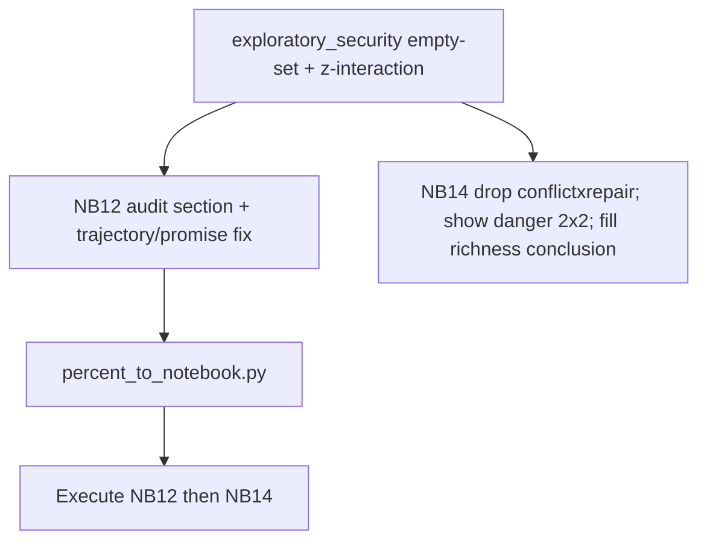

# Stage 11 analysis-freeze QA (four remaining items)

## Status vs your checklist

| Item | Status |
| --- | --- |
| 1. Empty exploratory sets → UNMEASURABLE | **Todo** — still show δ=0 for 0-topic rows |
| 2. Audit protective-commitment +.210 topics + fractional protection | **Todo** — add explicit topic cards / overlap QA in NB12 |
| 3. Remove conflict×repair; redesign danger×protection | **Todo** |
| 4. Thematic richness in NB14 | **Already done** — Section 2 + [`thematic_richness.py`](src/stage11_refined_construct_analysis/analysis/thematic_richness.py) + executed tables under `notebook_analysis/14_…/tables/thematic_richness_*` |

Do **not** reopen H1–H6 / NB13 freezes. NB13 stays the confirmatory source of truth; NB12/14 stay exploratory.

---

## 1. Empty topic sets → UNMEASURABLE (NB12)

**Bug:** [`trajectory_effects`](src/stage11_refined_construct_analysis/analysis/exploratory_security.py) and the promise loop in [`_src/12_exploratory_security_care_appearance.py`](notebooks/08_refined_construct_analysis/_src/12_exploratory_security_care_appearance.py) call `test_axis` on all-zero columns when `n_topics==0`, yielding δ=0 / “no reliable effect” (see `protective_commitment` strict and `material_security` strict in current trajectories CSV).

**Fix (locked):**

- In `trajectory_effects`: if `len(levels.get(level) or []) == 0`, append a row with `cliffs_delta/ci_*=NaN`, `verdict="unmeasurable"`, `note="zero topics"` — **do not** call `test_fn`.
- In NB12 promise loop: same rule when `len(tids)==0`.
- Trajectory plot: skip unmeasurable points (or plot as gaps), never as 0.
- Promise forest: already uses `dropna(subset=["cliffs_delta"])` — keep that.

Re-execute NB12 after the change so exported tables no longer imply a null test.

---

## 2. Protective-commitment +.210 audit + fractional protection QA (NB12)

Add a short **audit section** (markdown + tables), not a new composite.

**A. Four promise topics** (`promise_types.protective_commitment`: 247, 299, 338, 100 from [`exploratory_security_care_appearance.yaml`](configs/stage11/exploratory_security_care_appearance.yaml)):

| topic_id | label (from master) | taxonomy |
| --- | --- | --- |
| 247 | Promising You Will Not Be Alone | 4.6 |
| 299 | Pledging to Have Your Back | 4.6 |
| 338 | Promising Never to Do That Again | 9.2 |
| 100 | Promising to Find Her | 9.2 |

For each: per-topic Cliff’s δ (reuse `topic_level_forest`), label, taxonomy, one-line note that the **+.210 is this 4-topic exploratory bundle**, while family `protective_commitment` broad (14 topics) collapses to ~0.

**B. Fractional enacted-protection weights** — display existing `exploratory_protection_weights.json` with Pass-B caveat (weights from sampled contextual sentences, not full-topic census). Known weights include high protection fractions on 87/113/114 and low on 307.

**C. Overlap with external danger** — report topic-id intersection of `enacted_protection.broad` vs topics with positive `W_tk` mass on `RAX_external_danger_crisis`. Current check: **empty overlap** at topic-id level (document that; no need to rebuild protection after excluding shared topics). Still note conceptual co-occurrence risk inside mixed violence topics (87 etc.) that get fractional protection weight.

Save: `protective_commitment_topic_audit`, `protection_danger_topic_overlap`, refresh fractional weights table display.

---

## 3. Interactions: remove conflict×repair; fix danger×protection

### NB14 — remove degenerate conflict×repair

In [`_src/14_exploratory_presentation_results.py`](notebooks/08_refined_construct_analysis/_src/14_exploratory_presentation_results.py) Section 8:

- Delete `pres.conflict_repair_interaction` call, plot, and `conflict_x_repair_*` saves.
- Update banner text (drop “conflict×repair”).
- Leave [`conflict_repair_interaction`](src/stage11_refined_construct_analysis/analysis/presentation.py) in the module unused (no need to delete the helper).

**Replacement interaction in NB14:** reuse redesigned danger×protection **2×2 cell means** from NB12 (not a new darkness×reassurance model).

### NB12 — redesign danger×protection (presentation-ready)

Update [`danger_protection_interaction`](src/stage11_refined_construct_analysis/analysis/exploratory_security.py):

1. Z-score `danger` and `protection` within the estimation sample; interact `z_danger × z_prot`.
2. Fit OLS with controls + author cluster SE + reliability weights (same as now).
3. Save coefficients with clear term names (`z_danger`, `z_protection`, `z_danger_x_z_protection`).

Primary presentation artifact: **median-split 2×2** (lower/higher danger × lower/higher protection) with mean `rating_shrunk` (and n). Save as `danger_x_protection_quadrants` for all three protection indices (strict / moderate+fractional / broad). Plot a small heatmap for strict and moderate.

NB14 Section 8 then loads `danger_x_protection_quadrants` (+ standardized coef table) instead of conflict×repair.

---

## 4. Thematic richness (already present)

No new metrics work. Only:

- Fill the Section 2 **conclusion markdown** from executed numbers (exploratory wording): taxonomy δ≈+.14 but length/rarefaction-adjusted association is weak; topic richness stronger descriptively; richness β fades once reassurance/appearance/danger/tenderness enter — so the presentation line is closer to “attention allocation among themes” than “more themes.”
- Do not promote richness into NB13.

---

## Execution order

1. Patch `exploratory_security.py` (empty-set + standardized interaction + quadrant helper if useful).
2. Patch NB12 `_src` (audit section, trajectory/promise NaNs, save 2×2 table).
3. Patch NB14 `_src` (remove conflict×repair; load NB12 danger quadrants; richness conclusion).
4. Sync both notebooks; execute NB12 then NB14; verify tables:
   - trajectories: strict protective_commitment / material_security → `unmeasurable`
   - `protective_commitment_topic_audit`
   - `danger_x_protection_quadrants` + z-scored interaction
   - NB14 has no `conflict_x_repair_*`; richness tables unchanged/still present

## Out of scope

- Changing NB13 / H1–H6 freezes or thresholds
- New confirmatory protection composites
- Quoting broad appearance −.227 or broad protection ≈+.17 as final claims
- Editing Stage 10 notebooks
