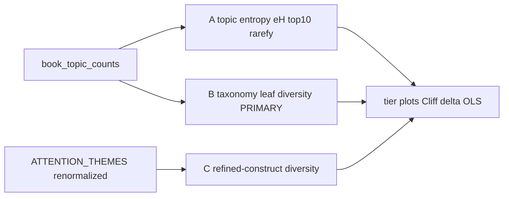

# Thematic richness section in NB14

## Claim boundary

- Exploratory only: does **not** change NB13 / H1–H6.
- Do **not** treat “higher-rated books are thematically richer” as a presentation finding until this section’s results are in.
- **Taxonomy-leaf richness is the headline exploratory measure**; fine-grained topic entropy is secondary (may partly reflect model fragmentation); refined-construct richness is a third, theory-facing check.

## Placement

Insert as **new Section 2** in [`notebooks/08_refined_construct_analysis/_src/14_exploratory_presentation_results.py`](notebooks/08_refined_construct_analysis/_src/14_exploratory_presentation_results.py), immediately after Section 1 (“What actually differs most?”). Renumber current Sections 2–11 → 3–12.

Opening question (markdown):

> Do higher-rated romance novels distribute narrative attention across a broader range of themes, or are they more concentrated around a few dominant themes?

Explicitly note why **non-zero topic count is invalid** (NB00: median topic present in ~96.5% of books; longer books touch more topics mechanically).

## New helper module

Add [`src/stage11_refined_construct_analysis/analysis/thematic_richness.py`](src/stage11_refined_construct_analysis/analysis/thematic_richness.py) (keep [`presentation.py`](src/stage11_refined_construct_analysis/analysis/presentation.py) focused on existing waterfall/dose helpers).

Core API:

| Function | Role |
| --- | --- |
| `shannon_entropy(P)` | \(H = -\sum p_i\log p_i\) on a row-normalized share vector (ignore zeros) |
| `effective_n(H)` | \(e^H\) |
| `topk_concentration(P, k=10)` | sum of top-k shares |
| `diversity_from_shares(wide)` | book-level table: `H`, `n_eff`, `top10`, optional `n_nonzero` (diagnostic only) |
| `load_topic_share_wide(cfg)` | hard counts via existing `exploratory_security.topic_share_matrix` (`topic_id >= 0`) |
| `load_leaf_share_wide(cfg)` | Stage 10 conditional `leaf_*` (~45) from analysis frame / `book_leaf_shares_cond` |
| `construct_share_wide(frame, cols)` | fixed presentation atom set from [`ATTENTION_THEMES`](src/stage11_refined_construct_analysis/analysis/presentation.py), **row-renormalized** so entropy is well-defined despite overlapping RAX definitions |
| `rarefy_topic_counts(counts_long, depth, seed)` | without-replacement sample of `depth` sentences from integer `n_sentences` per topic; return rarefied shares + observed unique topics |
| `map_rarefied_to_leaves` / `map_rarefied_to_constructs` | roll rarefied topic draws through taxonomy map / hard topic→atom mass |

**Rarefaction defaults (locked):**

- Depth = \(\lfloor\) 10th percentile of `n_sentences` among analysable books \(\rfloor\) (~3,098 on current corpus).
- Exclude books with `n_sentences < depth`.
- Seed = 42; one draw per book (report depth + N eligible in the table footer).
- Rarefaction runs on **topic counts**, then maps to leaves/constructs—no need for raw sentence files.

## Three resolutions

- **A. Topic:** hard BERTopic shares (non-outlier topics; corpus uses ~348 real topics in aggregation docs / share mass).
- **B. Taxonomy (primary):** conditional `leaf_*` shares (~45 meaningful leaves).
- **C. Refined constructs:** `ATTENTION_THEMES` atoms renormalized within-book (reassurance/security, danger, tenderness, affection, protection, repair, relational darkness, explicit sex, appearance, possession).

## Notebook section flow (Section 2)

1. **Compute & attach** richness columns onto `work` for A/B/C (+ rarefied variants for A/B at least).
2. **Plot 1 — tier violins/boxes:** low / mid / high `rating_class` for `n_eff` (taxonomy primary), optionally topic `n_eff` and taxonomy `top10` beside it.
3. **Cliff’s δ:** high vs low for key metrics via `nh.cliffs_delta_table` (same gate language as elsewhere; label exploratory). Interpret \(\delta>0\) as “high-rated books tend to be richer / less concentrated” depending on metric sign (flip sign note for concentration).
4. **Length-controlled OLS:**  
   `rating_shrunk ~ n_eff_taxonomy + n_sentences + publication_year + C(genre_group)`  
   with `mdl.fit_ols(..., cluster="author_id", weights="reliability")`. Same pattern for topic/construct `n_eff` and for rarefied taxonomy `n_eff`. Question answered in prose: among comparable length/era/genre, does diversity still track rating?
5. **Rarefaction check:** one table + short plot comparing full vs rarefied taxonomy `n_eff` by tier (eliminates length opportunity).
6. **Richness vs the right combination:** nested regressions  
   - M1: `rating ~ n_eff_taxonomy + controls`  
   - M2: `rating ~ n_eff_taxonomy + RAX_h3_emotional_side + RAX_appearance_grooming + RAX_external_danger_crisis + RAX_tenderness_core + controls`  
   Report whether richness β survives. One sentence: breadth itself vs mixture of known drivers.
7. **Nonlinear / decile plot:** taxonomy `n_eff` deciles → mean `rating_shrunk` (and/or `quality_resid`); read linear vs inverted-U vs flat.
8. **Security × richness 2×2:** median-split taxonomy richness × median-split emotional security (`RAX_h3_emotional_side` or `RAX_emotional_reassurance`); cell means of rating; short descriptive takeaway (connects to Stage 10/11 care story).
9. **Conclusion cell** with three pre-written templates (positive / taxonomy-only / null)—fill after numbers exist; keep wording exploratory.

## Outputs

Under `notebook_analysis/14_exploratory_presentation_results/`:

- Tables: `thematic_richness_book_metrics`, `thematic_richness_cliffs_delta`, `thematic_richness_ols`, `thematic_richness_rarefaction`, `thematic_richness_vs_drivers`, `richness_x_security_quadrants`
- Figures: `richness_by_rating_tier`, `richness_decile_rating`, `richness_x_security_heatmap` (or grouped bars)

## Docs / sync

- Update banner + section list in NB14 `_src` markdown; brief note in [`notebooks/08_refined_construct_analysis/README.md`](notebooks/08_refined_construct_analysis/README.md) that NB14 includes exploratory thematic-richness (not confirmatory).
- Append a short bullet to [`.cursor/plans/final_and_exploratory_nbs_c5879009.plan.md`](.cursor/plans/final_and_exploratory_nbs_c5879009.plan.md) under NB14 new sections.
- Sync notebooks: `.venv/bin/python scripts/stage11/percent_to_notebook.py notebooks/08_refined_construct_analysis/_src/14_exploratory_presentation_results.py`
- Execute NB14 (or at least the new section path) and verify tables/figures land.

## Out of scope

- Disparity (semantic distance between themes)
- Promoting richness into NB13 / H1–H6
- Editing Stage 10 NB06 or reopening construct freezes
- Using raw “number of topics > 0” as a reported richness measure
