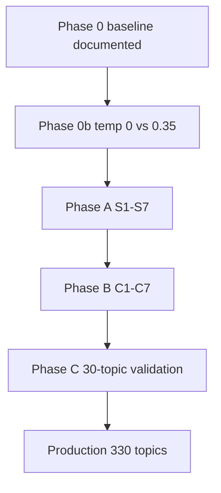

# Stage08 prompting research design (call 73)

**Date:** 2026-06-25  
**Status:** Active — production on hold pending prompt sweep  
**Model (locked):** `anthropic/claude-sonnet-4.6`  
**Prompt (not locked):** v2 baseline + OVAT sweep variants  
**Frozen model:** `placeholder_v4_models/final_compare/call_73`  
**Methodology reference:** [scene-segmentation-repro-lab](https://github.com/BakhturinaPolina/scene-segmentation-repro-lab) (research design only; no prompt text copied)

## Executive summary

5-topic pilots validated snippet grounding on intimacy beats (T0–4). The 20-topic panel surfaced **discourse/noise routing gaps** where Sonnet loses to Opus (T3, T6, T7, T12, T13) while winning on concrete scenes. **Defer the 330-topic production run** until OVAT prompting on Sonnet closes those gaps without regressing T0–4.

**Locked decoding for sweeps:** `temperature=0.0`, `top_p=1.0`, `max_tokens=256`, `reasoning=off`.

---

## 1. Pilot review: 5-topic vs 20-topic

### Artifacts

| Run | Path |
|-----|------|
| Sonnet 5-top | `results/stage08_llm_labeling/placeholder_v4_call73/model_sweep/limit5/labels_pos_*_sonnet*_limit5.json` |
| Sonnet 20-top | `results/stage08_llm_labeling/placeholder_v4_call73/model_sweep/limit20/labels_pos_*_sonnet*_limit20.json` |
| Opus 20-top | `results/stage08_llm_labeling/placeholder_v4_call73/model_sweep/limit20/labels_pos_*_opus*_limit20.json` |

### Topics 0–4: stable across 5 and 20

| Topic | Snippet ground truth | Sonnet 5 / 20 | Verdict |
|-------|---------------------|---------------|---------|
| T0 | Doorway / taxi departure | Doorway Hesitation Before Departure | Correct |
| T1 | Tender lip/temple kiss | Tender Kiss on Lips | Correct |
| T2 | Forehead/neck closeness | Close Physical Proximity and Touch | Correct |
| T3 | Love/hate inner swing | Conflicted Feelings (`scene`) | Grounded; routing debatable |
| T4 | Phone follow-up | Phone Call Follow-Up | Correct |

### Topics 5–19: Sonnet vs Opus (20-top)

| Topic | Sonnet | Opus | Gold routing |
|-------|--------|------|--------------|
| T5 | discourse ✓ | discourse ✓ | discourse |
| T6 | scene | discourse | discourse |
| T7 | scene | discourse | discourse |
| T10 | discourse ✓ | discourse ✓ | discourse |
| **T12** | **noise** | scene (scent) | scene (sensory) |
| T13 | scene | discourse | discourse |
| T14 | paratext ✓ | noise ✓ | paratext/noise |
| T17 | discourse ✓ | discourse ✓ | discourse |

**Head-to-head:** Sonnet 9 wins / 5 ties on labels; losses cluster on abstract / speech-tag / heterogeneous sensory topics.

---

## 2. OVAT matrix (Sonnet, temp=0)

**Baseline:** `v2` ([`v2_multi_genre.py`](../../src/stage08_llm_labeling/prompts/v2_multi_genre.py))

### 2A. Structural (Phase A)

| ID | Variable | Levels | Prompt ID / CLI |
|----|----------|--------|-----------------|
| S1 | Section order | keywords-first vs snippets-first | `v2_s1_snippets_first` |
| S2 | `max_snippets` | 3 vs 6 vs 8 | `--max-snippets` |
| S3 | `num_keywords` | 10 vs 15 | `--num-keywords` |
| S4 | Stage07 hints | on vs off vs emphasize | `v2`, `v2_s4_no_stage07`, `v2_s4_stage07_emphasize` |
| S5 | Few-shots | A–F vs none vs expanded | `v2`, `v2_s5_no_fewshot`, `v2_s5_expanded_fewshot` |
| S6 | Field order | default vs label-first | `v2_s6_label_first` |
| S7 | Schema emphasis | flat vs checklist | `v2_s7_checklist` |

### 2B. Conceptual (Phase B, on Phase A winner)

| ID | Variable | Prompt ID |
|----|----------|-----------|
| C1 | Discourse strictness | `v2_c1_discourse_strict` |
| C2 | Noise conservative | `v2_c2_noise_conservative` |
| C3 | Snippet-first grounding | `v2_c3_snippet_grounding` |
| C4 | Abstract → discourse | `v2_c4_abstract_discourse` |
| C5 | Merge-group ladder | `v2_c5_merge_ladder` |
| C6 | Anti-pattern labels | `v2_c6_label_antipatterns` |
| C7 | Discourse prevalence prior | `v2_c7_discourse_prior` |

**Priority (conceptual):** C3 → C1 → C2 → C4 → C5 → C6 → C7.

### 2C. Scoring rubric

| Dimension | Weight | Pass |
|-----------|--------|------|
| Snippet grounding | 40% | Match gold `snippet_grounding_pass` |
| `content_type` + `exclude_from_axes` | 30% | Match gold enums |
| Label quality | 20% | 2–6 words, no keyword chain |
| Schema validity | 10% | Zero jsonschema errors |

**Promotion gate:** No regression on T0–4; ≥2 topic improvement on discourse/noise stratum vs v2 on 30-topic panel.

**Gold panel:** [`data/stage08_benchmark/call73_panel_v1.json`](../../data/stage08_benchmark/call73_panel_v1.json)

---

## 3. Execution phases



**Sweep outputs:** `results/stage08_llm_labeling/prompt_sweeps/call73/` (see [`prompt_sweeps/call73/README.md`](../stage08_llm_labeling/prompt_sweeps/call73/README.md))

**Runner:**

```bash
bash scripts/stage08/run_stage08_prompt_sweep_call73.sh phase0b   # D2 only
bash scripts/stage08/run_stage08_prompt_sweep_call73.sh phase_a
bash scripts/stage08/run_stage08_prompt_sweep_call73.sh phase_b
bash scripts/stage08/score_stage08_prompt_sweep.py --sweep-dir results/stage08_llm_labeling/prompt_sweeps/call73
```

---

## 4. Sweep results (fill after runs)

### Phase 0b — decoding (D2)

| Cell | temp | T12 | T13 | Score | Routing | Discourse |
|------|------|-----|-----|-------|---------|-----------|
| D2a | 0.35 | noise | scene | 0.940 | 0.80 | 4/10 |
| D2b | 0.0 | noise | scene | 0.905 | 0.75 | 3/10 |

**Locked:** `temperature: 0.0` in yaml — but **S1 snippets-first at temp=0** beats D2b on routing (0.85 vs 0.75).

### Phase A — structural (pilot-20 panel)

| ID | Variant | Score | Routing | Discourse | Promoted? |
|----|---------|-------|---------|-----------|-----------|
| **S1** | **snippets-first** | **0.955** | **0.85** | **4/10** | **yes** |
| S2b | snippets=8 | 0.955 | 0.85 | 4/10 | tie |
| S2a | snippets=3 | 0.920 | 0.80 | 4/10 | no |
| S3 | keywords=10 | 0.940 | 0.80 | 3/10 | no |
| S5b | expanded few-shot | 0.890 | 0.70 | 3/10 | no |
| D2b | v2 baseline temp=0 | 0.905 | 0.75 | 3/10 | — |

**Phase A winner:** `v2_s1_snippets_first` — fixes **T12** (scene vs noise), improves T6 discourse; T3/T7/T13 still scene-heavy.

### Phase B — conceptual

| ID | Variant | Score | Routing | Discourse |
|----|---------|-------|---------|-----------|
| C2–C7 | (tie band) | 0.940 | 0.80 | 3/10 |
| C1 | discourse strict | 0.905 | 0.75 | 3/10 |

**Phase B winner:** No clear gain over S1 alone; **keep S1** for production (conceptual blocks did not beat snippets-first on discourse stratum).

### Phase C — 30-topic validation

| Prompt | Topics | Score | Routing | Discourse | Gate |
|--------|--------|-------|---------|-----------|------|
| `v2_s1_snippets_first` | **31/31** | **0.923** | **0.74** | **6/10** | **pass** (T12 scene; T29/T52 scene; extended strata covered) |

**Artifact:** `..._v2_s1_snippets_first_sweep_phase_c_topics.json`  
**Cost:** ~$0.60 / 31 topics (~$6.34 est. full 330)

**Production unlocked:** Run full 330 with yaml defaults (`v2_s1_snippets_first`, temp=0.0).

```bash
bash scripts/stage08/run_stage08_placeholder_v4_call.sh 73
```

---

## 5. Related docs

| Doc | Role |
|-----|------|
| [`stage08_progress.md`](stage08_progress.md) | Pipeline status |
| [`stage08_production_model_decision_call73.md`](stage08_production_model_decision_call73.md) | Model locked; prompt pending |
| [`placeholder_v4_call73_analysis_strategy.md`](placeholder_v4_call73_analysis_strategy.md) | Frozen call strategy |
